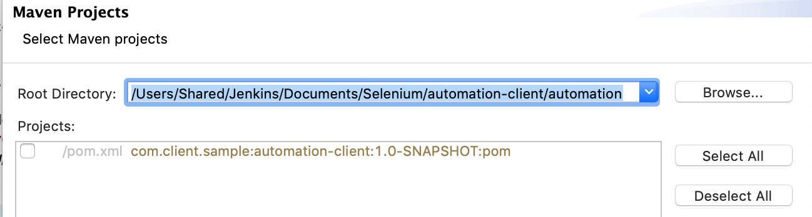

# Eclipse

## Download Eclipse

* [https://www.eclipse.org/downloads/eclipse-packages/](https://www.eclipse.org/downloads/eclipse-packages/)
* Download Eclipse IDE for Java Developers

## Launch automation project through Eclipse

* Open eclipse
* Select File → Import → Maven → Import existing maven project
* Select Next
* Root Directory: Select the automation project folder
* Select the project

* Select finish

## Download Eclipse Plugin

* Select Help -&gt; Eclipse Marketplace
* Search for Testng
* Install and restart

## Select Package View

* Select Package Explorer → Package Presentation → Hierarchical
* 

## Verify The Setup

* Select login test from:
  * src → test → java → module -&gt; web -&gt; tests → VerifyLoginTest.java
  * Right click and select: Run As → TestNG Tests
  * 

* * Test should pass
  * 

